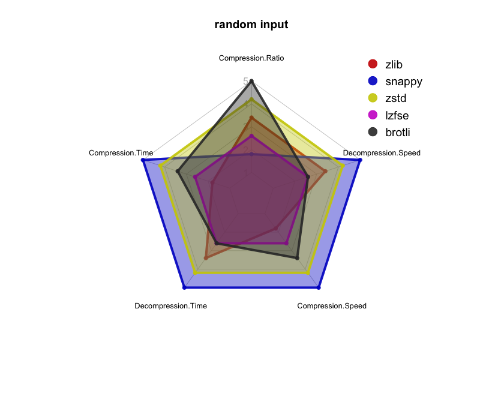
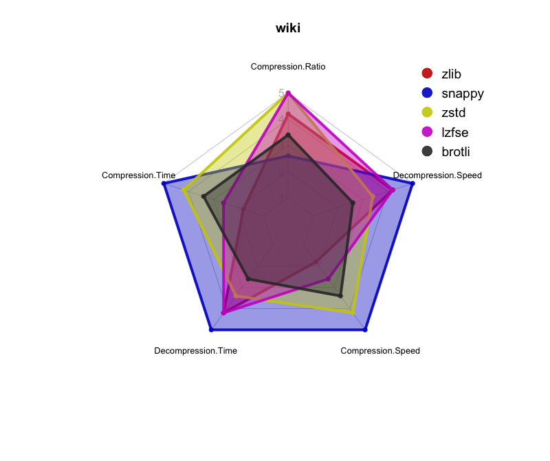
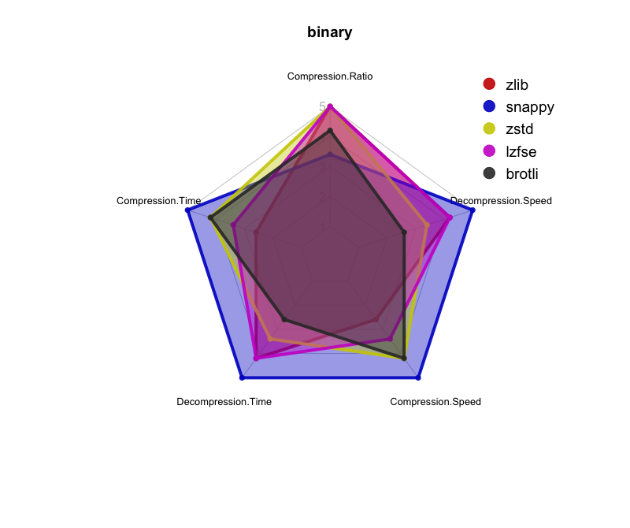

# Survey on Moderm Lossless Compression Methods

**This project is still working in progress...**

## About
Since the online service, digitalization and big data (ok I know this is a overused word) get more and more popular in these years, how to compress large amount of data and segments of data become a crucial problem and challenge for reaching high efficient service and nice user experience. 
In previous years, some of the big companies (Google, Facebook and Apple) open-sourced their compression methods. Therefore, this project want to evaluate whose methods is better and want to provide some guides of how to chose an appropriate compression method. 

## Compression Methods
The compression methods we evaluate are:

- [Snappy (2011, Google)](https://github.com/google/snappy)
- [Brotli (2015, Google)](https://github.com/google/brotli)
- [zstd (2015, Facebook)](https://github.com/facebook/zstd)
- [LZFSE (2016, Apple)](https://github.com/lzfse/lzfse)
- [Zip (1989, Phil Katz, PKWARE, Inc.)](http://www.7-zip.org/sdk.html)

## Evaluation
The condition of evaluation and how we performe evaluation (device, time of compression....
Follow what we mentioned on the slides 

### Performance Metrics (dependent variables)
According to the [Evaluating Compression Effectiveness](https://en.wikibooks.org/wiki/Data_Compression/Evaluating_Compression_Effectiveness#Decompression_Speed), we used the following performance metrics in the evaluation:

- Compression Ratio = *Uncompressed Sized / Compressed Size*
- Compression Speed (bytes/sec) = *Uncompressed Sized / Compressed Time*
- Decompression Speed (bytes/sec) = *Uncompressed Sized / Decompressed Time*

### Compressed Data
The data we used in evaluation can be categorize into three categories:

- Random: artificial files
- Natrual Langugage: textual content of wikipedia pages
- Binary: OSX executables

The input size of each kind of files are increased from 100 KB to 64 MB (each time increased by 100 KB). Hence, there are totally 640 input samples.

### Independent variables
15 different conditions (5 compression methods X 3 data types) with 50 samples for each input size (32,000 samples for each setup).

### Enviroment Setting and statistics
The machine we used in the evaluation is *Intel(R) Xeon(R) CPU E5-2680 v3 @ 2.50GHz 48 cores - 258 GB RAM
Ubuntu 16.4*. For operating each method, we used single thread process, C++ and turned off their streaming function. We assigned unique CPU for process (taskset) and data are compressed and decompressed in RAM.
Each setup processed 291 GB data. The whole evaluation process 4TB data. 

## Result
### Input Size vs. Compression Ratio
For random input,

For text input,

For binary input,

### Input Size vs. Compression and Decompression Time
For random input,

For text input,

For binary input,

### Input Size vs. Compression and Decompression Speed
#### Compression Speed
For random input,

For text input,

For binary input,

#### Deompression Speed
For random input,

For text input,

For binary input,

### Suggestion of chosing compression methods
For random input, 

For text input,

For binary input, 

### Interactive Visualization

## Data of Evaluation
**Formate of dataset of performance metric:** *original size \t compressed size \t compression time \t decompression time*

**Usage of operation files of each compression method**

